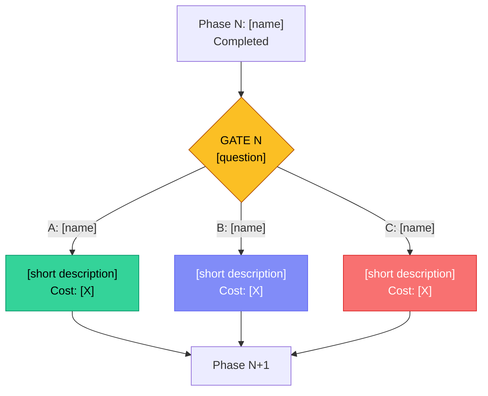

<!-- REFERENCE ONLY - The authoritative format is embedded in SKILL.md.
     This file serves as documentation/reference for people browsing the skill. -->

# GATE [N]: [Title - e.g. Strategy -> Research]

> Human-in-the-Loop Decision Gate | HITL Pipeline
> Generated: [timestamp]

---

## Summary of Results So Far

[3-5 sentence summary of what was done in the previous phase. Concrete facts, not generalities.]

## Key Findings

| # | Finding | Source | Confidence |
|---|---------|--------|------------|
| 1 | [Most important fact/conclusion] | [how we know] | High/Medium |
| 2 | [Finding] | [source] | [confidence] |
| 3 | [Finding] | [source] | [confidence] |
| 4 | [Finding] | [source] | [confidence] |
| 5 | [Finding] | [source] | [confidence] |

## Decision Question

**[Clear, specific question the user must answer]**

---

## Options

### Option A: [Name] -- Recommended

**Description:** [2-3 sentences describing what this option means in practice]

| Aspect | Rating |
|--------|--------|
| Estimated token cost | [e.g. ~80-120K] |
| Estimated $ cost | [e.g. $0.08-0.20] |
| Execution time | [e.g. 2-4 min] |
| Coverage/quality | High / Medium / Low |
| Risk | Low / Medium / High |

**Pros:**
- [Pro 1]
- [Pro 2]
- [Pro 3]

**Cons:**
- [Con 1]
- [Con 2]

---

### Option B: [Name]

**Description:** [2-3 sentences]

| Aspect | Rating |
|--------|--------|
| Estimated token cost | [e.g. ~40-80K] |
| Estimated $ cost | [e.g. $0.04-0.10] |
| Execution time | [e.g. 1-2 min] |
| Coverage/quality | High / Medium / Low |
| Risk | Low / Medium / High |

**Pros:**
- [Pro 1]
- [Pro 2]

**Cons:**
- [Con 1]
- [Con 2]

---

### Option C: [Name]

**Description:** [2-3 sentences]

| Aspect | Rating |
|--------|--------|
| Estimated token cost | [e.g. ~60-100K] |
| Estimated $ cost | [e.g. $0.06-0.15] |
| Execution time | [e.g. 1-3 min] |
| Coverage/quality | High / Medium / Low |
| Risk | Low / Medium / High |

**Pros:**
- [Pro 1]
- [Pro 2]

**Cons:**
- [Con 1]
- [Con 2]

---

## Flow Diagram

## Option Comparison

| Criterion | A: [name] | B: [name] | C: [name] |
|-----------|-----------|-----------|-----------|
| Cost | [$$/$/$$$] | [$$/$/$$$] | [$$/$/$$$] |
| Time | [fast/medium/slow] | [...] | [...] |
| Quality | [high/medium] | [...] | [...] |
| Risk | [low/medium/high] | [...] | [...] |
| Best when | [condition] | [condition] | [condition] |

## Recommendation

**Option A: [Name]** - [2-3 sentences explaining why this option is recommended given current findings. Concrete arguments, not "because it's the best".]

---

## Decision

> **Selected:** _[filled by system after user decision]_
> **Deliberation time:** _[quick / deep dive]_
> **Timestamp:** _[date and time]_
