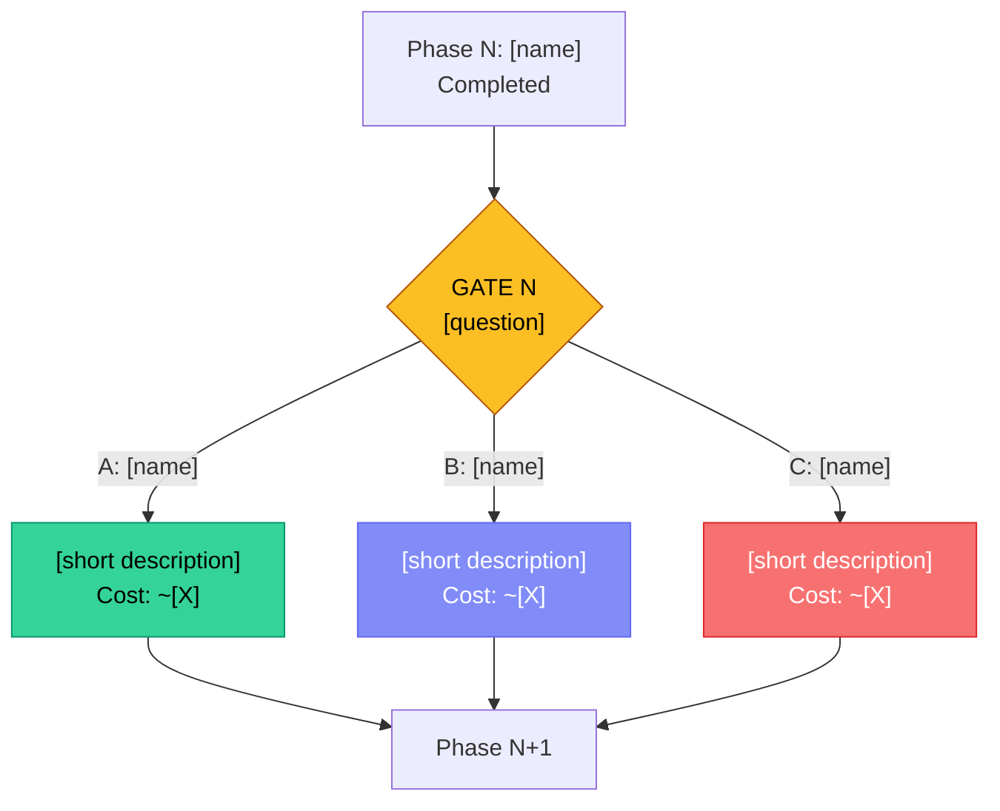

<!-- NOTE: This skill MUST run inline (not forked), because HITL gates
     require user interaction during execution.
     DO NOT add context: fork to frontmatter. -->

# HITL PIPELINE - Multi-Phase Agent Workflow with Decision Gates

You are the Orchestrator of a HITL pipeline. Your task is to conduct a multi-phase
workflow with real subagents and decision gates, where a human makes
key decisions between phases.

## PIPELINE TOPIC

$ARGUMENTS

If $ARGUMENTS is empty, ask the user for the topic and DO NOT continue without a response.

---

## PIPELINE ARCHITECTURE

The pipeline consists of **5 working phases**, **1 summary phase**, and **3 decision gates (HITL)**:

```
STRATEGY -> [GATE 1] -> RESEARCH -> DEBATE -> [GATE 2] -> BUILD -> [GATE 3] -> QA -> SUMMARY
```

Each gate:
1. Creates a Markdown file in the `gates/` folder
2. Displays a brief summary with 3 options in chat
3. Waits for the user's decision
4. Logs the decision in MANIFEST.md

### Model routing (70-90% cost savings)
- **Orchestrator (you):** the model you're running in - coordination, synthesis
- **Research subagents:** model: "haiku" - data gathering doesn't need an expensive model
- **Five Minds Debate:** model: "sonnet" - reasoning and argumentation
- **Build subagents:** model: "sonnet" - code and architecture
- **QA subagents:** model: "sonnet" (code review, security), model: "haiku" (perf metrics)

---

## PIPELINE FILES

At the start, create this structure:

```
MANIFEST.md          <- pipeline state, phase results, decisions
gates/               <- folder for decision gates
  GATE_1_strategy_research.md
  GATE_2_debate_build.md
  GATE_3_build_qa.md
```

Use Bash tool: `mkdir -p gates` to create the folder.

---

## MANIFEST.md - FORMAT

Create MANIFEST.md at the start of the pipeline using Write tool. Use EXACTLY this structure:

````markdown
# MANIFEST - HITL Pipeline

## Meta
- **Topic:** [topic from $ARGUMENTS]
- **Start:** [timestamp]
- **Status:** In progress | Phase 1/6
- **Main model:** [model you're running in]
- **Subagent models:** sonnet/haiku

---

## Phase 1: Strategy

### Topic Analysis
[2-3 sentence description of the problem/task]

### Key Research Questions
1. [Question 1]
2. [Question 2]
3. [Question 3]

### Scope
- **IN:** [what is in scope]
- **OUT:** [what is out of scope]

### Decomposition
| Subtask | Type | Priority | Complexity |
|---------|------|----------|------------|
| [Subtask 1] | Research | High | M |
| [Subtask 2] | Build | Medium | L |

---

## Gate 1: Strategy -> Research
- **Selected option:** _[filled after decision]_
- **Rationale:** _[filled after decision]_
- **Gate file:** `gates/GATE_1_strategy_research.md`

---

## Phase 2: Research

### Subagents Launched
| Agent | Direction | Status | Key Result |
|-------|-----------|--------|------------|
| _[filled after completion]_ |

### Results Synthesis
_[5-10 sentence summary: what aligns, what differs, what gaps exist]_

### Key Facts
- _[filled after completion]_

---

## Phase 3: Five Minds Debate

### Gold Solution
_[3-5 sentence summary of Gold Solution from debate]_

### Key Decisions from Debate
1. _[filled after completion]_

### Risks Identified by Shadow
- _[filled after completion]_

---

## Gate 2: Debate -> Build
- **Selected option:** _[filled after decision]_
- **Rationale:** _[filled after decision]_
- **Gate file:** `gates/GATE_2_debate_build.md`

---

## Phase 4: Build

### What Was Built
_[filled after completion]_

### Files Created/Modified
| File | Action | Description |
|------|--------|-------------|
| _[filled after completion]_ |

### Technical Decisions
- _[filled after completion]_

---

## Gate 3: Build -> QA
- **Selected option:** _[filled after decision]_
- **Rationale:** _[filled after decision]_
- **Gate file:** `gates/GATE_3_build_qa.md`

---

## Phase 5: QA

### QA Results
| Category | Issues | Critical | Fixed |
|----------|--------|----------|-------|
| _[filled after completion]_ |

### Critical Findings
- _[filled after completion]_

---

## Summary

### Final Result
_[3-5 sentence summary of what was achieved]_

### Key Decisions
1. Gate 1: _[what was chosen and why]_
2. Gate 2: _[what was chosen and why]_
3. Gate 3: _[what was chosen and why]_

### Recommendations for Future
- _[filled at end]_

### Metrics
- **Duration:** [from start to end]
- **Subagents launched:** [N]
- **Phases completed:** 6/6
- **Decision gates:** 3/3

---

## Decision Log

| Gate | Option | Deliberation | Deep dive? | Timestamp |
|------|--------|-------------|------------|-----------|
| 1: Strategy->Research | _[A/B/C]_ | _[quick/deep]_ | _[Yes/No]_ | _[timestamp]_ |
| 2: Debate->Build | _[A/B/C]_ | _[quick/deep]_ | _[Yes/No]_ | _[timestamp]_ |
| 3: Build->QA | _[A/B/C]_ | _[quick/deep]_ | _[Yes/No]_ | _[timestamp]_ |
````

---

## PROCEDURE - Execute Step by Step

### PHASE 1: STRATEGY

1. **MANDATORY:** Create MANIFEST.md using the format above (Write tool) and the `gates/` folder (Bash: `mkdir -p gates`)
2. Analyze the topic: identify 3-5 key research questions
3. Define scope: what is IN and what is OUT
4. Propose initial decomposition into subtasks
5. Update MANIFEST.md section "Phase 1: Strategy" (Edit tool)
6. Display status to user: "Phase 1/6 completed: Strategy"

### GATE 1: Strategy -> Research

Execute the GATE procedure (described below) with these options:

**Title:** Strategy -> Research
**Context:** Results of strategic analysis
**Options:**
- **Broad Research** - launch 4-6 subagents investigating different aspects in parallel (technology, UX, competition, community). Maximum coverage, higher cost.
- **Focused Research** - launch 2-3 subagents on the most important directions. Faster, cheaper, risk of oversight.
- **Research + Prototype** - 2 subagents research + 1 creates a prototype sketch in parallel. Faster hypothesis validation.

**Recommendation:** Broad Research (for complex topics) or Focused Research (for simpler ones)

### PHASE 2: RESEARCH

Based on the decision from Gate 1:

1. **MANDATORY:** Read MANIFEST.md using Read tool - this is your only memory between phases. If the pipeline is long, earlier phases may be out of context. MANIFEST.md contains everything you need.
2. Launch subagents via Agent tool:

**Broad Research option (4-6 agents in parallel):**
Launch agents in parallel (multiple Agent tool calls in one message):
- Agent Research-Tech: `model: "haiku"`, prompt: "Investigate the technical aspect: [specific question from MANIFEST]. Use WebSearch. Report in max 300 words: key facts, sources, recommendation."
- Agent Research-UX: `model: "haiku"`, prompt: "Investigate the UX/user aspect: [question]. Use WebSearch. Report in max 300 words."
- Agent Research-Competition: `model: "haiku"`, prompt: "Investigate competition/alternatives: [question]. Use WebSearch. Report in max 300 words."
- Agent Research-Community: `model: "haiku"`, prompt: "Investigate community/opinions: [question]. Use WebSearch (Reddit, HN, forums). Report in max 300 words."

Use `run_in_background: true` for each agent so they run in parallel.

**Focused Research option (2-3 agents):**
Choose 2-3 most important directions from Phase 1. Same parameters (model: "haiku").

**Research + Prototype option:**
2 agents research (model: "haiku") + 1 agent creates an initial solution sketch (model: "sonnet").

3. Collect results from all subagents
4. Synthesize: what aligns, what doesn't, what gaps exist
5. Update MANIFEST.md section "Phase 2: Research" (Edit tool)
6. Status: "Phase 2/6 completed: Research - [N] sources investigated"

### PHASE 3: FIVE MINDS DEBATE

1. **MANDATORY:** Read MANIFEST.md using Read tool - this is your only memory between phases.
2. Launch Five Minds debate via Agent tool:
   - Create **one** subagent with parameters:
     - `model: "sonnet"` (debate requires reasoning)
     - `run_in_background: false` (debate must complete before proceeding)
     - prompt: "Read the file `.claude/skills/five-minds/SKILL_v2_terminal_rich.md` using Read tool. Then conduct a full Five Minds Protocol debate following the instructions from that file on the topic: [PASTE HERE: research results synthesis from MANIFEST.md, key facts, questions to resolve]. At the end, save the entire debate output to the file `FIVE_MINDS_DEBATE.md` using Write tool."
   - IMPORTANT: Five Minds is a structured monologue of one LLM playing 5 roles - DO NOT launch 5 separate agents.
3. After subagent completes: read `FIVE_MINDS_DEBATE.md` (Read tool)
4. Extract Gold Solution and key decisions
5. Update MANIFEST.md section "Phase 3: Debate" (Edit tool)
6. Status: "Phase 3/6 completed: Five Minds Debate - Gold Solution ready"

### GATE 2: Debate -> Build

Execute the GATE procedure with options:

**Title:** Debate -> Build
**Context:** Gold Solution from Five Minds debate
**Options:**
- **Full Implementation** - implement the entire Gold Solution. All recommendations, full scope.
- **MVP First** - implement the minimal version. Only critical elements of Gold Solution.
- **Iterative Build** - 2 phases: first the foundation, then review, then the rest. More control.

**Recommendation:** Full Implementation (if Gold Solution is clear) or MVP First (if scope is too large)

### PHASE 4: BUILD

Based on the decision from Gate 2:

1. **MANDATORY:** Read MANIFEST.md using Read tool - this is your only memory between phases.
2. Execute implementation according to Gold Solution and selected option
3. If implementation requires multiple files, use subagents (model: "sonnet"):
   - Agent Backend: logic, API, data
   - Agent Frontend: UI, components, styling
   - Agent Integrator: connecting parts, smoke tests
4. Update MANIFEST.md section "Phase 4: Build" (Edit tool)
5. Status: "Phase 4/6 completed: Build - [description of what was built]"

### GATE 3: Build -> QA

Execute the GATE procedure with options:

**Title:** Build -> QA
**Context:** What was built in Phase 4
**Options:**
- **Full QA** - code review + tests + security check + performance check. Most thorough.
- **Core QA** - code review + tests. Faster, without security/performance audit.
- **QA + Review Debate** - Full QA + second round of Five Minds as architectural review (same mechanism as Phase 3: spawn Agent that reads five-minds/SKILL_v2_terminal_rich.md). Most expensive, best quality.

**Recommendation:** Full QA (for most cases)

### PHASE 5: QA

Based on the decision from Gate 3:

1. **MANDATORY:** Read MANIFEST.md using Read tool - this is your only memory between phases.
2. Execute QA according to selected option:

**Full QA option (agents in parallel):**
- Agent QA-Code: `model: "sonnet"`, prompt: "Do a code review: [files from MANIFEST]. Look for bugs, edge cases, code smells. Max 300 words."
- Agent QA-Security: `model: "sonnet"`, prompt: "Check security: OWASP Top 10, hardcoded secrets, injection. Max 200 words."
- Agent QA-Perf: `model: "haiku"`, prompt: "Check performance: O() complexity, bundle size, memory leaks. Max 200 words."

**Core QA option:**
Only Agent QA-Code (model: "sonnet").

**QA + Debate option:**
QA agents (as above) + second round of Five Minds (same mechanism as Phase 3).

3. Collect results, fix critical bugs
4. Update MANIFEST.md section "Phase 5: QA" (Edit tool)
5. Status: "Phase 5/6 completed: QA - [N] issues found, [M] fixed"

### PHASE 6: SUMMARY

1. **MANDATORY:** Read the ENTIRE MANIFEST.md using Read tool
2. Update the "Summary" and "Metrics" sections in MANIFEST.md
3. Display the final summary to the user:
   - What was accomplished
   - Key decisions at gates
   - Final result
   - Recommendations for future
4. Status: "Pipeline completed: 6/6 phases, 3/3 gates"

---

## HITL GATE PROCEDURE

For EVERY decision gate, execute exactly these steps:

### Step 1: Create the gate file

Use Write tool to create `gates/GATE_N_name.md` with EXACTLY this format:

````markdown
# GATE [N]: [Title]

> Human-in-the-Loop Decision Gate | HITL Pipeline
> Generated: [timestamp]

---

## Summary of Results So Far

[3-5 sentence summary of what was done in the previous phase. Concrete facts, not generalities.]

## Key Findings

| # | Finding | Source | Confidence |
|---|---------|--------|------------|
| 1 | [Most important fact/conclusion] | [how we know] | High/Medium |
| 2 | [Finding] | [source] | [confidence] |
| 3 | [Finding] | [source] | [confidence] |
| 4 | [Finding] | [source] | [confidence] |
| 5 | [Finding] | [source] | [confidence] |

## Decision Question

**[Clear, specific question the user must answer]**

---

## Options

IMPORTANT: Randomize option order! The recommended option does NOT have to be first.
Use random A/B/C ordering for each gate to prevent rubber-stamping.

### Option A: [Name] (add "-- Recommended" if this option is recommended)

**Description:** [2-3 sentences describing what this option means in practice]

| Aspect | Rating |
|--------|--------|
| Estimated token cost | [e.g. ~80-120K] |
| Estimated $ cost | [e.g. $0.08-0.20] |
| Execution time | [e.g. 2-4 min] |
| Coverage/quality | High / Medium / Low |
| Risk | Low / Medium / High |

**Pros:**
- [Pro 1]
- [Pro 2]
- [Pro 3]

**Cons:**
- [Con 1]
- [Con 2]

---

### Option B: [Name]

[same format as Option A]

---

### Option C: [Name]

[same format as Option A]

---

## Option Comparison

| Criterion | A: [name] | B: [name] | C: [name] |
|-----------|-----------|-----------|-----------|
| Cost | [$/$$/$$$ ] | [...] | [...] |
| Time | [fast/medium/slow] | [...] | [...] |
| Quality | [high/medium] | [...] | [...] |
| Risk | [low/medium/high] | [...] | [...] |
| Best when | [condition] | [condition] | [condition] |

## Flow Diagram



## Recommendation

**Option [X]: [Name]** - [2-3 sentences explaining why this option is recommended. Concrete arguments, not "because it's the best".]

---

## Decision

> **Selected:** _[filled by system after user decision]_
> **Deliberation time:** _[quick / deep dive]_
> **Timestamp:** _[date and time]_
````

### Step 2: Display summary in chat

Write the user a brief summary - this is a TWO-LEVEL GATE:
quick decision in chat + option for deep dive in the file.

```
---
## GATE [N]: [Title]

[2-3 sentences of context - what was established, what decision is needed]

**A) [Name]** [add asterisk if recommended] - [1 sentence description]
**B) [Name]** [add asterisk if recommended] - [1 sentence description]
**C) [Name]** [add asterisk if recommended] - [1 sentence description]

Full analysis: `gates/GATE_N_name.md`

Which option do you choose? (A/B/C, or "I'll read the file" for deep dive)
---
```

### Step 3: Wait for decision

Ask the user for their decision. Accept:
- "A", "B", "C" - quick decision
- "1", "2", "3" - numerically
- Full option name - e.g. "Broad Research"
- "I'll read the file" / "deep dive" - user wants to read the gate file, wait until they return with a decision
- Additional questions - answer and re-ask

### Step 4: Log the decision

Update MANIFEST.md (Edit tool):
- Gate section: fill in selected option and rationale
- "Decision Log" table: add a row
- Update the "Decision" section in the gate file

### Step 5: Continue pipeline

Proceed to the next phase based on the selected option.

---

## QUALITY RULES

1. **MANIFEST.md is the only persistent source of truth** - in long pipelines context gets compressed. MANIFEST.md survives. ALWAYS read it at the start of each phase.
2. **ALWAYS update MANIFEST.md** after each phase and gate using Edit tool
3. **Launch subagents in parallel** where possible (run_in_background: true, multiple Agent calls in one message)
4. **Each subagent gets NARROW context** - only their question + needed facts from MANIFEST, not the whole file
5. **Display statuses frequently** - user must see progress ("Phase 2/6...", "Waiting for 3/4 subagents...", "Gate 1: waiting for your decision")
6. **Gate files are PERMANENT** - never delete them, they are the archival record of decisions
7. **Recommendation does not mean decision** - ALWAYS wait for user response at a gate
8. **Language: English** - all output, file names, comments in English
9. **Do not generate code in Phases 1-3** - first research and decisions, then implementation
10. **Anti-rubber-stamp:**
    - Randomize A/B/C option order at each gate - recommended NOT always as "A"
    - If user picks recommended 3x in a row: display "I notice you're choosing recommended options without deep dive. The pipeline works best when gates are genuine moments of reflection. Would you like to read the full analysis?"
    - In the gate file, mark which option is recommended, but place it randomly as A, B, or C
11. **Model routing:** Research = haiku, Debate/Build/QA = sonnet. Never set model: "opus" on subagents - too expensive.

---

## EMERGENCY

- **Subagent returns no result:** If after 2 minutes no response - skip it, note in MANIFEST.md "Agent [X] returned no result", continue with what you have
- **User wants to abort:** Save current state in MANIFEST.md with note "INTERRUPTED at Phase N, can resume from Gate [last]"
- **Topic too simple:** If after Phase 1 it's clear the topic doesn't need 6 phases - suggest a shortened pipeline to the user (3 phases: Strategy -> Build -> QA, 1 gate)
- **Context filling up:** Read MANIFEST.md and continue - the file has everything you need. This is your backup when context compression removes earlier phases.
- **Pipeline resumption:** If user wants to resume an interrupted pipeline - read MANIFEST.md, find the last completed phase/gate, continue from the next step

---

Begin the pipeline. Topic: $ARGUMENTS
